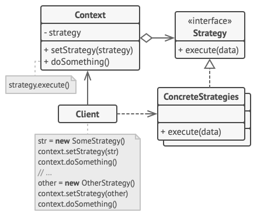

Strategy is a behavioral design pattern that lets you define a family of algorithms, put each of them into a separate class, and make their objects interchangeable.

1. The Context maintains a reference to one of the concrete strategies and communicates with this object only via the strategy interface.
2. The Strategy interface is common to all concrete strategies. It declares a method the context uses to execute a strategy.
3. Concrete Strategies implement different variations of an algorithm the context uses.
4. The context calls the execution method on the linked strategy object each time it needs to run the algorithm. The context doesn’t know what type of strategy it works with or how the algorithm is executed.
5. The Client creates a specific strategy object and passes it to the context. The context exposes a setter which lets clients replace the strategy associated with the context at runtime.



The `Strategy` interface declares operations common to all supported versions of some algorithm. The context uses this interface to call the algorithm defined by the concrete strategies.
```
public interface Strategy {
    int execute(int a, int b);
}
```

Concrete strategies implement the algorithm while following the base strategy interface. The interface makes them interchangeable in the context.
```
public class AddConcreteStrategy implements Strategy {
    @Override
    public int execute(int a, int b) {
        return a + b;
    }
}

public class SubtractConcreteStrategy implements Strategy {
    @Override
    public int execute(int a, int b) {
        return a - b;
    }
}

public class MultiplyConcreteStrategy implements Strategy {
    @Override
    public int execute(int a, int b) {
        return a * b;
    }
}
```
The context defines the interface of interest to clients. The context maintains a reference to one of the strategy objects. The context doesn't know the concrete class of a strategy. It should work with all strategies via the strategy interface.

Usually the context accepts a strategy through the constructor, and also provides a setter so that the strategy can be switched at runtime.

The context delegates some work to the strategy object instead of implementing multiple versions of the algorithm on its own.
```
public class Context {
    private Strategy strategy;

    void setStrategy(Strategy strategy){
        this.strategy = strategy;
    }

    int executeStrategy(int a, int b){
        return strategy.execute(a, b);
    }
}
```
The client code picks a concrete strategy and passes it to the context. The client should be aware of the differences between strategies in order to make the right choice.
```
import java.util.Scanner;

public class ExampleApplication {
    public static void main(String[] args) {
        //Create context object
        Context context = new Context();
        Scanner sc = new Scanner(System.in);
        //Read first number
        System.out.println("Enter first number: ");
        int first_number =  sc.nextInt();
        //Read last number
        System.out.println("Enter second number: ");
        int second_number =  sc.nextInt();
        //Read the desired action from user input
        System.out.println("Enter action: ");
        String action =  sc.nextLine();

        if ("+".equals(action))
            context.setStrategy(new AddConcreteStrategy());

        if ("-".equals(action))
            context.setStrategy(new SubtractConcreteStrategy());

        if ("*".equals(action))
            context.setStrategy(new MultiplyConcreteStrategy());

        int result = context.executeStrategy(first_number, second_number);
        System.out.println(result);
    }
}
```
### Applicability
**Use the Strategy pattern when you want to use different variants of an algorithm within an object and be able to switch from one algorithm to another during runtime.**

The Strategy pattern lets you indirectly alter the object’s behavior at runtime by associating it with different sub-objects which can perform specific sub-tasks in different ways.

**Use the Strategy when you have a lot of similar classes that only differ in the way they execute some behavior.**

The Strategy pattern lets you extract the varying behavior into a separate class hierarchy and combine the original classes into one, thereby reducing duplicate code.

**Use the pattern to isolate the business logic of a class from the implementation details of algorithms that may not be as important in the context of that logic.**

The Strategy pattern lets you isolate the code, internal data, and dependencies of various algorithms from the rest of the code. Various clients get a simple interface to execute the algorithms and switch them at runtime.


